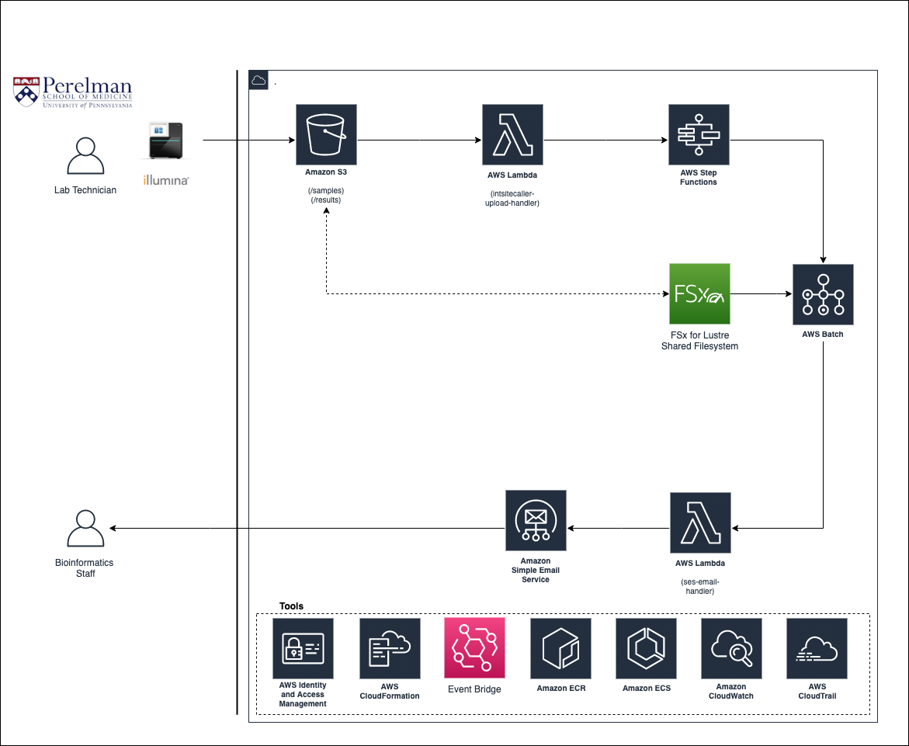

## intSiteCaller CloudFormation Templates

### Background

This project contains CloudFormation templates to configure an AWS Batch-based genomics workflow.

### Prerequisites

You must have the aws cli installed and configured to connect to your account.

Follow this link for installation directions:

https://docs.aws.amazon.com/cli/latest/userguide/install-cliv2.html

You'll want to run aws configure to set up a profile to connect to your AWS account.

More on that here:

https://docs.aws.amazon.com/cli/latest/userguide/cli-chap-configure.html

### Usage

See [`create_from_scratch.sh`](templates/create_from_scratch.sh) for detailed instructions on how to create the environment.

### Architecture

The templates contained in this project will create the architecture depicted below, which is based off of the 
Secondary Analysis reference architecture described in the AWS Genomics Whitepaper, available here:

https://aws.amazon.com/blogs/industries/whitepaper-genomics-data-transfer-analytics-and-machine-learning-using-aws-services/

